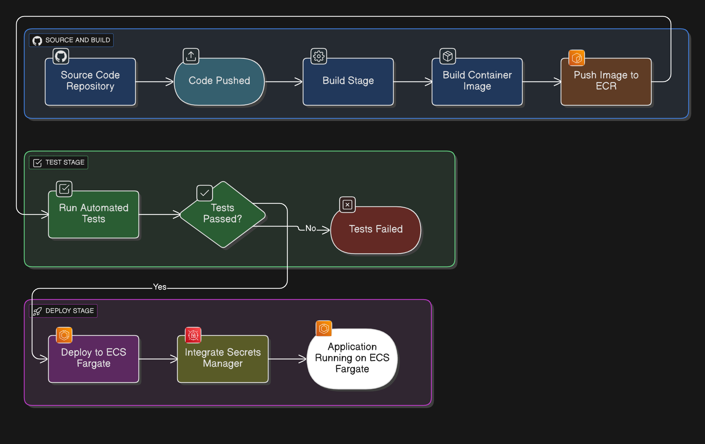

# 🔄 CI/CD Pipeline with GitHub Actions + AWS ECS (Fargate)

## 📌 Project Overview
This project demonstrates how to implement a **CI/CD pipeline** using **GitHub Actions** for a containerized web application (Node.js + React).  
The pipeline automates the full lifecycle from **Build → Test → Deploy** into **AWS ECS Fargate**, ensuring **zero-downtime deployments** and **rollback support**.

---

## 🏗️ Architecture & Workflow



**Key Stages:**
1. **Source Control:** Code is pushed to GitHub.
2. **Build & Test:** GitHub Actions compiles, runs tests, and builds a Docker image.
3. **Image Registry:** The container image is pushed to **Amazon Elastic Container Registry (ECR)**.
4. **Deploy:** ECS Fargate service pulls the new image and updates tasks with rolling deployment.
5. **Secrets Management:** **AWS Secrets Manager** stores DB/API credentials for secure access.
6. **Monitoring & Rollbacks:** ECS service ensures rollback in case of deployment failure.

---

## ⚙️ Features

- **End-to-End CI/CD:** Fully automated pipeline triggered on every push to `main`.
- **Zero-Downtime Deployments:** ECS rolling updates with multiple tasks running in parallel.
- **Rollback Mechanism:** Automatic rollback to the last stable revision if deployment fails.
- **Secure Secrets Management:** Uses **AWS Secrets Manager** for credentials and environment variables.
- **Scalable & Serverless:** Runs on **ECS Fargate** (no EC2 management required).

---

## 🛠️ Tech Stack

- **CI/CD Tool:** GitHub Actions  
- **Containerization:** Docker  
- **Container Registry:** Amazon ECR  
- **Orchestration:** Amazon ECS (Fargate)  
- **Secrets Management:** AWS Secrets Manager  
- **App Example:** Node.js backend + React frontend  

---

## 📂 Repository Structure

```bash
├── .github/
│   └── workflows/
│       └── ci-cd.yml       # GitHub Actions workflow definition
├── app/
│   ├── backend/            # Node.js API
│   └── frontend/           # React frontend
├── Dockerfile              # Multi-stage Docker build
├── ecs-task-def.json       # ECS Task Definition
├── diagram.png             # CI/CD Architecture diagram
└── README.md               # Project documentation
